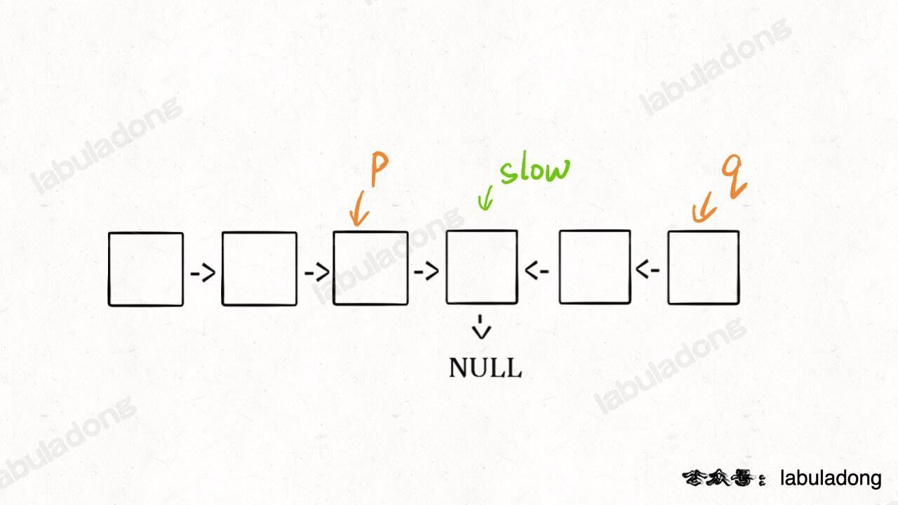
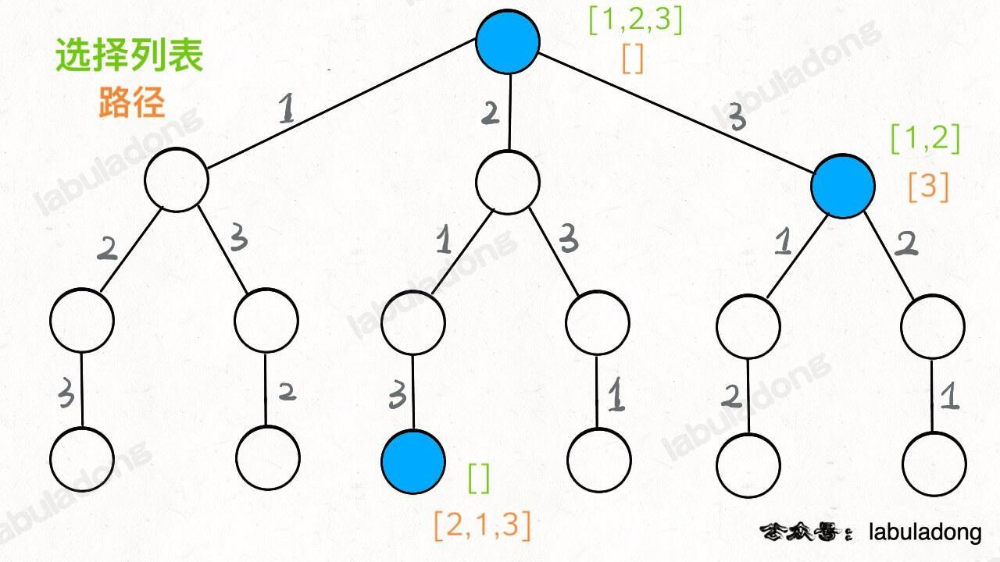
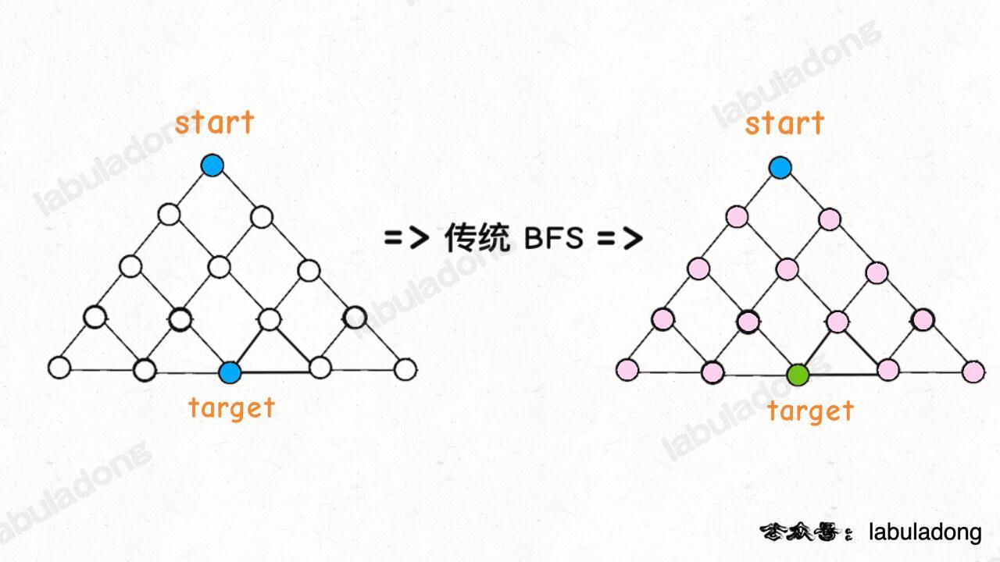
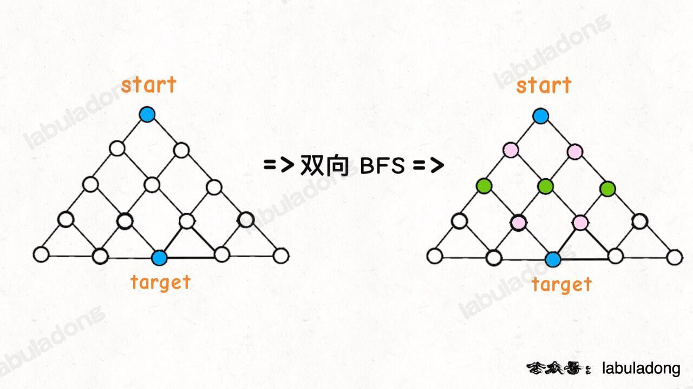
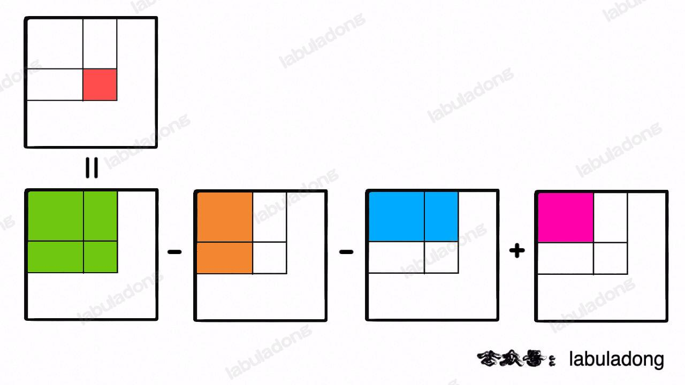
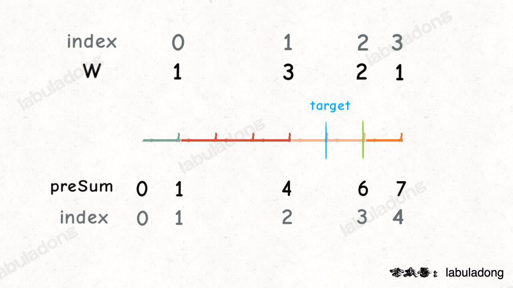
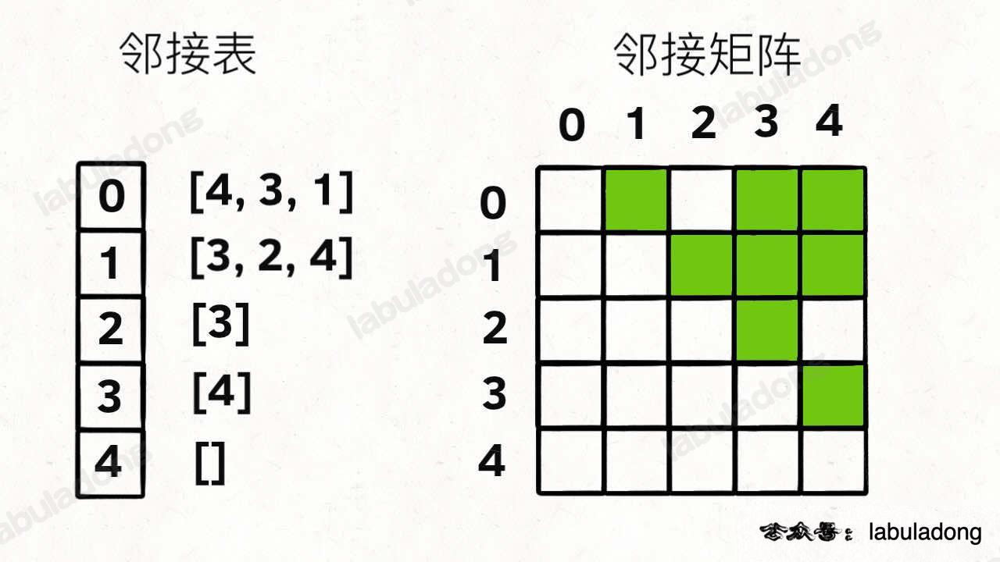

# algorithm

算法学习

## 2023-7-13

### Lc4 二分算法

寻找两个有序数组的中位数，时间复杂度要求log(m+n)。思路：寻找两个有序数组第k(m+n/2)小的数，需要区分奇偶，分别寻找两个数组k/2 -1位置的元素， 若a[k/2 -1] <= b[k/2-1] 则丢掉a[k/2 - 1]
及它以前的元素，否则，丢掉b[k/2 -1]及以前的元素，k则减去丢掉的元素，下次只需寻找第（k-丢掉元素个数） 位置的元素。边界情况 注意k/2-1
是否大于数组长度，若大于，则取另外数组k位置的元素即可，k==1时，则比较两个数组的第一个元素，谁更小，谁符合要求返回。

### Lc11 双指针

当a[left] <= a[right]时，抛弃left,left++,因为 area = min(a[left],a[right]) * (right-left);如果抛弃right,则后面的值不会大于area,只有移动较小的一方，
才有可能比上次a[min]大。

### lc15 双指针

首先要数组排序，如果a[i] 和 a[i - 1]相等，直接跳过即可。关键条件 排序， a[first] + a[second] + a[third] = 0; 时间复杂度 O(N`2) 空间复杂度 O(N)

### lc16 双指针

解法与15类似

### lc18 26 27 双指针

解法与15类似

### lc31 下一个排列 双指针

左边i寻找一个较小数，右边i+1需找一个较大数，较小数尽量靠右，较大数尽可能小，则i+1 到n为降序，而后从右边再照一个数>a[i],进行交换，i+1后的序列再进行反转，变为升序

### lc33 旋转数组

这里的关键是不论如何总有一边是有序的

### lc34 二分

两次二分查找即可，第一次遍历左边，遍历一遍即为target第一次出现的位置，相反，遍历右边一遍，即为target最后一次的位置

### lc35 二分

left最后指向的一定是第一个大于等于target的位置

### lc36 有效的数独

问题的关键在每个小九宫格，用所在行/3,所在列/3 即可表示

### lc1991 寻找数组的中心索引

比较简单，遍历数组的每个元素，元素左边之和与元素右边之和相等，即满足条件

### lc56 合并区间

重点先排序，排序之后那么可合并的区间一定是连续的，其次是合并规则，想象两条线如果相交，则第一条线的end >= 第二条线的start

### lc48 矩阵旋转

重点要求不能使用额外的内存，只能进行元素交换，首先可以找到一个公式 a[j][n-1-i] = a[i][j]; 即为a[i][j]旋转后的位置，每次旋转90°，每个元素旋转4次可以回到原点，因此每一轮都可以进行四次元素交换，就这样可以
得到4个交换公式。那些元素需要交换？分为奇偶，偶数为i<n/2,j<n/2.奇数为i<n/2,(实际上为n-1/2,这里便于合并)，j<n+1/2;

### lc 零矩阵

需要两个数组分别记录为0的行和列，再遍历更新即可，空间复杂度为i+j,时间复杂度为i*j

### lc498 对角线遍历

需要找规律，根据对角线遍历，区分奇偶，没太理解

### lc14 最长公共前缀

写了两种，横向扫描和纵向扫描

### lc5 最长回文串

### lc141、142、160、19、21、23、86、876关于单链表算法的一些技巧

> 参考自labuladong的算法笔记： https://labuladong.github.io/algo/

#### 1.合并两个有序链表<br>

- 这里会用到一个虚拟头节点dummy,可以简化边界情况的处理

#### 2.单链表的分解

- 这里每次迭代的时候，直接p=p.next是不可行的，分解后的两个链表可能存在环,以下是正确写法

```java
Node temp=p.next;
        p.next=null;
        p=temp;
```

#### 3.合并k个有序链表

- 这里需要使用到一个特殊的数据结构，优先级队列，java中已有实现--**PriorityQueue**,底层数据结构是二叉堆，一种特殊的完全二叉树，由数组实现<br>
- 优先级队列的重要操作:swim(上浮)，sink(下沉)，时间复杂度是log(k),k是优先级队列中的元素个数

#### 4.单链表的倒数第k个节点

- 正常的解法是一共遍历两次链表，第一次得到链表长度，然后遍历第n-k+1个节点<br>
- 如果只让遍历一次呢？<br>
- 先让一个指针走k步，那么剩余n-k可走，这时让另一个指针从头节点出发，与第一个指针一起走，第一个指针走到尽头时，第二个指针走了n-k步，它恰好就是倒数第k个节点.这样一次遍历就解决了问题。

#### 5.单链表的中点

一般想法也是遍历两次。如何遍历一次呢？<br>

- 使用快慢指针同时指向头节点，每当慢指针前进一步，快指针就前进两步，这样当快指针走到终点时，慢指针就到达中点
- 需要注意的是，元素个数为偶数时，慢指针指向的是中间两个的后一个元素

#### 6.判断链表中是否包含环，及得到环的起点

- 使用5中的算法，当快慢指针相遇时，说明存在环
- 快慢指针相遇后，假设slow走了k步，则fast走了2k步，多走的k步=环内的距离，设相遇的地点距离环起点为m,则头节点到环起点的距离为k-m，让slow = head,那么slow到
  环起点的距离为k-m，而fast到环起点的距离也恰好为k-m，当它们再次相遇时，就是环的起点

#### 7.两个链表是否相交

- 解决这个问题的核心是，让p1、p2通过某些方式同时到达相交点c
- 可以让p1走完A之后继续走B,p2走完B之后走A，理论上他们走的总距离时相等的，当他们相遇时，就是相交点

#### 8.递归反转单链表

```java
//输入一个单链表的头节点，将该链表反转，返回新的头节点
public ListNode reverse(ListNode head){
    if(head == null || head.next == null){
        return head;
    }
    ListNode last = reverse(head.next);
    head.next.next = head;
    head.next = null;
    return last;
}

//输入一个单链表的头节点，反转链表的前n个节点，返回新的头节点
ListNode next = null;//第n+1个节点
public ListNode reverseN(ListNode head, int n){
        if(n == 1){
            next = head.next;
            return head;
        }
        ListNode last = reverseN(head.next, n-1);
        head.next.next = head;
        head.next = next;
        return last;
}

//输入一个单链表的头节点，反转链表的[left,right]节点，返回新的头节点
public ListNode reverseBetween(ListNode head, int left, int right){
    if(left == 1){
        //反转链表的前n个节点
        reverseN(head, right);    
    }
    //如果head是索引1，那么要反转的起点是left;如果head.next是索引一，那么要反转的起点就是left-1.
    head.next = reverseBetween(head.next, left-1, right-1);
    return head;
}
```

#### 9.k个一组反转链表

```java
//k个一组反转链表，返回新的头节点
public ListNode reverseKGroup(ListNode head, int k){
    if(head == null) return null;
    ListNode a, b;
    a = b = head;
    for(int i = 0; i < k; i++){
        //数量不足k个，直接返回
        if(b == null)return head;
        b = b.next;
    }
    //反转[a,b)
    ListNode newNode = reverse(a, b);
    //递归
    a.next = reverseKGroup(b, k);
    return newNode;
}
private ListNode reverse(ListNode a, ListNode b){
    ListNode p = a, pre = null, temp;
    while(p != b){
        temp = p.next;
        p.next = pre;
        pre = p;
        p = temp;
    }
    return pre;
}
```

#### 10.判断回文链表

- 寻找回文串的核心思想是从中心向两端拓展
- 判断回文串则是从两端向中心遍历

```java
/*
 * 递归判断回文链表
 * 时空复杂度都为O(n)
 */
ListNode left;
public boolean isPalindrome(ListNode head){
    left = head;
    return palindrome(head);
}
private boolean palindrome(ListNode head){
    if(head == null){
        return true;    
    }
    boolean res = palindrome(head.next);
    res = res && left.val == head.val;
    left = left.next;
    return res;
}

/*
 * 中点反转判断法
 * 时间复杂度为O(n),空间复杂度为O(1)
 * 会改变原始链表结构
 */
public boolean isPalindrome(ListNode head){
    //利用快慢指针找到链表中点
    ListNode slow, fast;
    while(fast != null && fast.next != null){
        slow = slow.next;
        fast = fast.next.next;
    }
    //链表个数为奇数时，slow需要往后移动，使得右边长度小于左边
    if(fast != null)slow = slow.next;
    //反转以slow为头节点的链表
    ListNode right = reverse(slow);
    ListNode left = head;
    while(right != null){
        if(right.val != left.val){
            return false;
        }
        right = right.next;
        left = left.next;
    }
    /*
      如果要恢复原来的链表结构,如下图
      ListNode q = reverse(slow);
      ListNode p = null;
      while(right != null){
          //链表个数为偶数
          p=left;
          //奇数
          p = left.next;
      }  
      p.next = reverse(q);
     */
    return true;
}
private ListNode reverse(ListNode head){
    ListNode p = head, pre = null, temp = null;
    while(p != null){
        temp = p.next;
        p.next = pre;
        pre = p;
        p = temp;
    }
    return pre;
}
```


### lc167、26、27、283、344、5、83 数组问题中的双指针技巧

#### 1.快慢指针技巧

- 原地修改数组问题，或是对某些元素原地删除。另一大类就是滑动窗口算法，这个后面总结

#### 2.左右指针的常用算法

- 二分查找

```java
int binarySearch(int[]nums,int target){
        int left=0,right=nums.length-1;
        while(left<=right){
            int mid=(left+right)/2;
            if(nums[mid]==target){
                return mid;
            }else if(nums[mid]>target){
                right=mid-1;
            }else{
                left=mid+1;
            }
        }
        //未找到
        return-1;
}
```

- 查找一个排序数组的两数之和
- 反转数组
- 回文串的判断
- 寻找最长回文串，解决问题的关键是，**从中间向两端扩散的双指针技巧**

### 二叉树/递归的核心思维

#### 1.二叉树的两种解题思维模式

- 是否可以通过遍历一边二叉树得到答案。**遍历的思维模式**
- 是否可以通过子问题(子树)的答案推导出原问题的答案。**分解问题的思维模式**
- 如果单独抽出一个二叉树节点，可以做什么事情？可以在什么时候做？(前序、中序、后序)

#### 2.深入理解前中后序

- 前中后序是遍历二叉树过程中，处理每一个节点的三个特殊的时间点。二叉树中，每一个节点都有 **唯一** 属于自己的前中后序位置
- 二叉树的所有问题，就是让你在前中后序位置注入巧妙的代码逻辑，去达到自己的目的，你只需要简单的思考当前节点应该做什么，其他的不用管，抛给二叉树遍历框架，递归会在所有节点做相同的操作

#### 3.从树的角度看动归/回溯/DFS算法的区别与练习

他们都属于二叉树的拓展，只是关注点不同<br>

- 动态规划算法属于分解问题的思路，它的关注点在整个 **子树**
- 回溯算法属于遍历的思路，它的关注点在节点间的 **树枝**
- DFS算法属于遍历的思路，它的关注点在 **单个节点**

#### 4.层序遍历

层序遍历属于迭代遍历，代码框架如下：

```java
//输入一个二叉树的根节点，层序遍历这棵二叉树
void levelTraverse(TreeNode root){
        if(root==null)return;
        Queue<TreeNode> q=new LinkedList<>();
        q.offer(root);
        //从上到下遍历二叉树的每一层
        while(!q.isEmpty()){
            int sz=q.size();
            //从左至右遍历同一层的每一个节点
            for(int i=0;i<sz; i++){
                TreeNode cur=q.poll();
                //将下一层节点放入队列
                if(cur.left!=null){
                    q.offer(cur.left);
                }
                if(cur.right!=null){
                    q.offer(cur.right);
                }
            }
        }
}
```

### 动态规划的解题框架

- 动态规划问题的一般形式是求最值，核心问题是穷举。状态转移方程、最优子结构、重叠子问题是动态规划三要素。
- 明确base case -> 明确 **[状态]** -> 明确 **[选择]** -> 定义dp数组/函数的含义<br>
  代码框架:

```
# 自顶向下递归的动态规划
def dp(状态1, 状态2, ...):
    for 选择 in 所有可能的选择:
        # 此时的状态已经因为做了选择而改变
        result = 求最值(result, dp(状态1, 状态2, ...))
    return result

# 自底向上迭代的动态规划
# 初始化 base case
dp[0][0][...] = base case
# 进行状态转移
for 状态1 in 状态1的所有取值：
    for 状态2 in 状态2的所有取值：
        for ...
            dp[状态1][状态2][...] = 求最值(选择1，选择2...)

```

- 递归算法的时间复杂度：子问题的个数 * 解决一个子问题需要的时间
- 动态规划问题的解法：1.暴力递归(一般会超出时间限制) 2.带备忘录的递归解法(自顶向下) 3.dp数组的迭代解法(自底向上)

### 回溯算法的解题框架

- 抽象的说解决一个回溯问题，实际上就是在遍历一棵决策树，树的每个叶子节点放着一个合法答案。
- 在回溯树的一个节点上思考三个问题
    - 路径：已经做出的选择
    - 选择列表：当前可以做的选择
    - 结束条件： 到达决策树的底层，无法再做选择
- 核心就是递归之前做选择，递归之后撤销选择,代码框架

```
def backtrack(...):
    for 选择 in 选择列表:
        做选择
        backtrack(...)
        撤销选择
```

- 抽象出来的回溯树，也可以叫决策树，每个节点都在做决策，上文也说过回溯算法的重点在 **树枝**

> 

### 回溯算法 -- 排列、组合(子集)问题

- 形式一：元素无重复不可复选

```java
//组合(子集)问题回溯算法框架
void backtrack(int[]nums,int start){
        for(int i=start;i<nums.length;i++){
        //做选择
        track.add(num[i]);
        //注意参数
        backtrack(nums,i+1);
        //撤销选择
        track.removeLast();
        }
}

//排列问题回溯算法框架
void backtrack(int[]nums){
        for(int i=0;i<nums.length;i++){
        //剪枝逻辑
        if(used[i]){
        continue;
        }
        //做选择
        track.add(num[i]);
        used[i]=true;
        //注意参数
        backtrack(nums);
        //撤销选择
        track.removeLast();
        used[i]=false;
        }
}
```

- 形式二：元素无重复可复选

```java
//组合(子集)问题回溯算法框架
void backtrack(int[]nums,int start){
        for(int i=start;i<nums.length;i++){
        //做选择
        track.add(num[i]);
        //注意参数
        backtrack(nums,i);
        //撤销选择
        track.removeLast();
        }
}

//排列问题回溯算法框架
void backtrack(int[]nums){
        for(int i=0;i<nums.length;i++){
        //做选择
        track.add(num[i]);
        //注意参数
        backtrack(nums);
        //撤销选择
        track.removeLast();
        }
}
```

- 形式三：元素可重复不可复选

```java
//组合(子集)问题回溯算法框架
void backtrack(int[]nums,int start){
        for(int i=start;i<nums.length;i++){
        //剪枝逻辑，跳过值相同的相邻树枝
        if(i>start&&nums[i]==nums[i-1]){
        continue;
        }
        //做选择
        track.add(num[i]);
        //注意参数
        backtrack(nums,i+1);
        //撤销选择
        track.removeLast();
        }
}

//排列问题回溯算法框架
void backtrack(int[]nums){
        for(int i=0;i<nums.length;i++){
        //剪枝逻辑
        if(used[i]){
        continue;
        }
        //剪枝逻辑，固定相同的元素在排列中的相对位置
        if(i>0&&nums[i]==nums[i-1]&&!used[i-1]){
        continue;
        }
        //做选择
        track.add(num[i]);
        used[i]=true;
        //注意参数
        backtrack(nums);
        //撤销选择
        track.removeLast();
        used[i]=false;
        }
}
```

- 组合(子集)问题，重点是迭代开始用start,就是通过保证元素的相对顺序，防止出现重复的子集

```java
//元素不可复选
for(int i=start;i<length; i++){
        backtrack(i+1,...)
        }
//元素可复选
        for(int i=start;...){
        backtrack(i,...)
        }
//元素重复 首先要排序，使重复元素相邻
        Arrays.sort();
        for(...){
        //裁剪相邻相等的树枝
        if(i>start&&nums[i]==nums[i-1]){
        continue;
        }
}
```

- 排列问题，通过boolean[] 数组控制访问过的元素,如果元素可复选，则去掉boolean[]数组即可

```java
boolean[]used=new boolean[nums.length];
        for(int i=0;i<nums.length;i++){
        if(used[i]){
        continue;
        }
        //如果元素重复(同样需要先排序)，则通过固定相等元素的位置，来保证不会走重复的树枝，！used[i-1]保证i-1始终在前面
        if(i>0&&nums[i]==nums[i-1]&&!used[i-1]){
        continue;
        }
}
//对于元素重复，还有一种更易理解的方法
// 初始化一个数组中不存在的元素
int preNum=-999;
for(...){
        //原理使裁剪掉同一层相邻且相等的树枝
        if(nums[i]==preNum){
        continue;
        }
        preNum=nums[i];
}
```

### BFS算法框架
- 常见场景：在一幅“图”中找到从起点start不断扩散到终点target的最近距离(和树的层序遍历很像)，重要的数据结构：队列，代码框架：

```java
//计算起点start到终点target的最近距离
int BFS(Node start,Node target){
    Queue<Node> q;//核心数据结构
    Set<String> visited; //避免走回头路
    q.offer(start);
    visited.add(start);
    while(!q.isEmpty){
        //临时变量，因为q的size会变
        int sz = q.size();
        //将当前队列的节点向四周扩散
        for(int i = 0; i < sz; i++){
            Node cur = q.poll();
            if(cur == target){
                return step;    
            }
            //将cur的相邻节点加入队列
            for(Node x : cur.adj()){
                if(!visited.contains(x)){
                    q.offer(x);
                    visited.add(x);
                }       
            }
        }
        step++;
    }
    //走到这里，说明无解，不能走到目标节点
}
```
- 知道就行：双向BFS优化，与传统的BFS时间复杂度相同，但少遍历一些节点，效率确实快一些，使用限制的必须知道终点target

>
> 

```java
//计算起点start到终点target的最近距离
int BFS(Node start,Node target){
    Set<String> q1;
    Set<String> q2;
    Set<String> visited; //避免走回头路
    q1.offer(start);
    q2.offer(target);
    while(!q1.isEmpty && !q2.isEmpty()){
        //哈希集合在遍历的过程中不能修改，用 temp 存储扩散结果
        Set<Node> temp;
        //将当前队列的节点向四周扩散
        for(String cur : q1){
            if(q2.contains(cur)){
                return step;    
            }
            //这个位置滞后，否则q1 和 q2永远不会相遇
            visited.add(x);
            //将cur的相邻节点加入
            for(Node x : cur.adj()){
                if(!visited.contains(x)){
                    temp.add(x);
                }       
            }
        }
        step++;
        //这里交换 q1 q2，下一轮 while 就是扩散 q2
        q1 = q2;
        q2 = temp;
    }
    //走到这里，说明无解，不能走到目标节点
}
```

### 二分搜索详解
- **二分思维的精髓是：通过已知的信息尽可能的收缩搜索空间**
- 最基本的二分查找框架，局限性在于不能用于查找边界情况，比如target第一次或最后一次出现的位置

```java
//寻找一个数
int binarySearch(int[] nums, int target){
    //查找区间[left,right]
    int left = 0, right = nums.length - 1;
    //终止条件 left = right + 1
    while(left <= right){
        //防止溢出
        int mid = left + (right - left) / 2;
        if(nums[mid] == target){
            //找到目标元素
            return mid;
        }else if(nums[mid] > target){
            right = mid - 1;
        }else if(nums[mid] < target){
            left = mid + 1;
        }
    }
    //未找到
    return -1;
}
```
- 寻找左侧边界的二分搜索，这里举出两种写法

```java
//寻找一个数第一次出现的位置 写法一：区间左闭右开
int binarySerch(int[] nums, int target){
    //查找区间[left,right)
    int left = 0, right = nums.length;
    //终止条件 left = right
    while(left < right){
        int mid = left + (right -left) / 2;
        //边界向左靠拢
        if(nums[mid] == target){
            right = mid;
        }else if(nums[mid] > target){
            right = mid;
        }else if(nums[mid] < target){
            left = mid + 1;
        }
    }
    //防止数组越界
    if(left < 0 || left >= nums.length){
        return -1;    
    }
    return nums[left] == target ? left : -1;
}

//写法二，区间左闭右闭
int binarySearch(int[] nums, int target){
    //区间为[left,right]
    int left = 0, right = nums.length - 1;
    //终止条件为left = right + 1;
    while(left <= right){
        int mid = left + (right - left) / 2;
        if(nums[mid] == target){
            right = mid - 1;
        }else if(nums[mid] > target){
            right = mid - 1;
        }else if(nums[mid] < target){
            left = mid + 1；
        }
    }
    //防止数组越界
    if(left < 0 || left >= nums.length){
        return -1;
    }
    return nums[left] == target ? left : -1;
}
```

- 寻找右侧边界的二分查找

```java
//寻找一个数最后一次出现的位置 写法一：区间左闭右开
int binarySearch(int[] nums, int target){
    int left = 0, right = nums.length;
    while(left < right){
        int mid = left + (right - left) / 2;
        if(nums[mid] == target){
            left = mid + 1;
        }else if(nums[mid] > target){
            right = mid;
        }else if(nums[mid] < target){
            left = mid + 1;
        }
    }
    if(left - 1 < 0 || left - 1 >= nums.length){
        return -1;
    }
    return nums[left - 1] == target ? left-1 : -1;
}
//第二种写法 左闭右闭
int binarySearch(int[] nums, int target){
    int left = 0, right = nums.length - 1;
    while(left <= right){
        int mid = left + (right - left) / 2;
        if(nums[mid] == target){
            left = mid + 1;
        }else if(nums[mid] > target){
            right = mid - 1;
        }else if(nums[mid] < target){
            left = mid + 1;
        }
    }
    if(left - 1 < 0 || left - 1 >= nums.length){
        return -1;
    }
    return nums[left - 1] == target ? left-1 : -1;
    //或下面这种写法
    /*
    if(right < 0 || right >= nums.length){
        return -1;
    }
    return nums[right] == target ? right : -1; 
    */
}
```
- 二分查找的应用
  - 一般是求最值，题目可以抽象成一个自变量x(一般是题目返回的结果)，和关于x的线性函数f(x),题目会给定一个目标值 f(x) = target,让你求x的值
  - 这时的left、right就是x的取值范围，根据题目确定是左侧边界搜索还是右侧边界搜索
  - 例如给定一个递增数组，让你返回值为target的最小下标
  
```java
public int findMinIndex(int[] nums, int target){
    //下标的取值范围
    int left_x = 0, right_x = nums.length;
    while(left_x < right_x){
        int mid = left_x + (right_x-left_x)/2;
        if(f(nums,mid) >= target){
            right = mid;
        }else{
            left = mid + 1;
        }
    }
    return left;
}
//这时下标索引就是自变量x, 返回数组中的值，随着x增大，nums[i]呈线性递增
private int f(int[] nums, int x){
    return nums[x];
}
```

### 滑动窗口算法
- 算法时间复杂度一般为O(n)，一般用于解决子串、子数组问题
- 核心模板框架：

```java
void slidingWindow(String s){
    //用合适的数据结构记录窗口中的数据
    Map<Character, Integer> window = new HashMap<>();
    //左闭右开滑动区间
    int left = 0, right = 0;
    while(right < s.length()){
        //c是移入窗口的字符
        char c = s.charAt(right);
        window.put(c, window.getOrDefault(c, 0) + 1);
        //增大窗口
        right++;
        //进行窗口内的数据更新
        ...
        //判断左侧区间是否需要收缩
        while(window needs shrink){
            //d是移出窗口的字符
            char d = s.charAt(left);
            window.put(d, window.get(d) - 1);
            //缩小窗口
            left++;
            //进行窗口内数据的更新
            ...
        }
    }
}
```
- 使用该框架时需要思考几个问题
  - 什么时候扩大窗口
  - 什么时候缩小窗口
  - 什么时候更新结果
  
### 股票买卖问题
- dp动态规划，记住状态转移方程
```java
/**
 i 代表第i天， k代表交易限制次数，买卖一次为一次交易，0代表当前魏未持有股票，1代表当前持有股票
 k=1或不限制k时，可以忽略k成为二维数组
 */
dp[i][k][0] = Math.max(dp[i-1][k][0], dp[i-1][k][1] + prices[i]);
dp[i][k][1] = Math.max(dp[i-1][k][1], dp[i-1][k-1][0] - prices[i]);
base case
dp[0][0] = 0;
dp[0][1] = -prices[0];
```

### 打家劫舍问题
- 不要被数组索引迷惑，状态就是索引，选择是抢或不抢，要想知道num[0]处的最大金额，必须要先走num[1.2.3...],base case是num[>=length] = 0
- 状态转移方程 ： res_i = Math.max(抢：nums[i] + dp(i+2),不抢：dp(i+1));

### nSum问题
- 给定int[] nums和target,求nums中和为target的2个元素，可能存在多对，返回List<List<Integer>>,拓展：3求个元素的和？4个..N个
- 数组首先要排序，然后使用下面的代码框架:
```java
//其中start为元素起点，n为计算几个元素的和,target使用long类型，int可能溢出
List<List<Integer>> nSum(int start, int n, long target, int[] nums){
    if(n < 2){
        return;
    }
    List<List<Integer>> res = new ArrayList<>();
    //求两个元素和
    if(n == 2){
        int l = start, r = nums.length - 1;
        while(l < r){
            int left = nums[l], right = nums[r];
            int sum = left + right;
            if(sum == target){
                res.add(new ArrayList<>(Arrays.asList(left,right)));
                //移动指针,跳过重复元素
                while(l < r && nums[l] == left) l++;
                while(l < r && nums[r] == right) r--;
            }else if(sum > target){
                while(l < r && nums[r] == right) r--;   
            }else if(sum < target){
                while(l < r && nums[l] == left) l++;
            }   
        }
        return res;
    }
    //大于两个元素,使用递归
    else{
        for(int i = start; i < nums.length; i++){
            List<List<Integer>> ns = nSum(i + 1, n-1, target-nums[i], nums);
            for(List<Integer> li : ns){
                li.add(nums[i]);
                res.add(li);
            }   
            //跳过重复元素
            while(i < nums.length-1 && nums[i] == nums[i+1]) i++;
        }
        return res;
    }
}
```

### 前缀和数组

- 前缀和技巧用于原始数组不被修改的情况下，快速、频繁地计算一个索引区间内的元素之和
```java
/**
 * 一维数组的前缀和
 */
int[] preSum;//preSum[i]存储 0 到 i-1 的元素之和
public void pre(int[] nums){
    preSum = new int[nums.length+1];
    for(int i = 1; i < preSum.length; i++){
        preSum[i] = preSum[i-1] + nums[i-1];    
    }
}

/**
 * 二维数组的前缀和
 */
int[][] preSum;//preSum[i] 存储左上坐标[0,0],右下坐标[i-1,j-1]的元素之和
public void pre(int[][] nums){
    preSum = new int[nums.length+1][nums[0].length+1];
    for(int i = 1; i < preSum.length; i++){
        for(int j = 1; j < preSum[0].length; j++){
            //这个公式想象一下面积图，很好理解
            preSum[i][j] = preSum[i-1][j] + preSum[i][j-1] + nums[i-1][j-1] - preSum[i-1][j-1];
        }    
    }
    //任意子矩阵的元素和可以转化成它周边几个大矩阵的元素和的运算，如下图：
        int x1,y1;//左上角坐标
        int x2,y2;//右下角坐标
        area = preSum[x2+1][y2+1] - preSum[x1][y2+1] - preSum[x2+1][y1] + preSum[x1][y1];
        //这里不能是x1+1,加一就多减了
}
```



### 差分数组

- 差分数组主要应用场景是频繁的对原始数组某个区间的元素进行增减
```java
/**
 * 差分数组
 */
class Difference {
  int[] diff;

  //构造差分数组
  public Difference(int[] nums) {
    diff = new int[nums.length];
    diff[0] = nums[0];
    for (int i = 1; i < diff.length; i++) {
      diff[i] = nums[i] - nums[i - 1];
    }
  }

  //对区间元素进行增减
  public void increment(int start, int end, int val) {
    diff[start] += val;
    if (end + 1 < diff.length) {
      diff[end + 1] -= val;
    }
  }
  
  //返回结果
  public int[] result(){
    int[] res = new int[diff.length];
    res[0] = diff[0];
    for (int i = 1; i < res.length; i++) {
      res[i] = res[i-1] + diff[i];
    }
    return res;
  }
}
```

### 二维数组的遍历技巧

- 原地旋转矩阵，先按对角线交换，然后每行交换
```java
//顺时针旋转矩阵，左上右下对角线交换
int n = nums.length;
for(int i = 0; i < n; i++){
    for(int j = i; j < n; j++){
        int temp = nums[i][j];
        nums[i][j] = nums[j][i];
        nums[j][i] = temp;
    }
}
//交换一维数组元素
for(int[] arr : nums){
    reverse(arr);
}
private void reverse(int[] arr){
    int left = 0, right = arr.length-1;
    while(left < right){
        int temp = arr[left];
        arr[left] = arr[right];
        arr[right] = temp;
        left++;
        right--;
    }
}

//逆时针旋转矩阵,右上左下对角线交换
for(int i = 0; i < n; i++){
    for(int j = 0; j < n-i; j++){
        int temp = nums[i][j];
        nums[i][j] = nums[n-j-1][n-i-1];
        nums[n-j-1][n-i-1] = temp;
    }
}
//交换一维数组元素
for(int[] arr : nums){
    reverse(arr);
}
```
- 矩阵的螺旋遍历，解题的核心思路是按照上、右、下、左的顺序遍历数组，并使用四个变量记录边界
```java
public List<Integer> spiralOrder(int[][] matrix){
    int m = matrix.length, n = matrix[0].length;
    //上下边界
    int upper_bound = 0, lower_bound = m-1;
    //左右边界
    int left_bound = 0, right_bound = n-1;
    List<Integer> res = new ArrayList<>();
    终止条件res.size = m*n 
    while(res.size() < m*n){
        if(upper_bound <= lower_bound){
            for(int j = left_bound; j <= right_bound; j++){
                res.add(matrix[upper_bound][j]);    
            }   
            upper_bound++;
        }
        if(left_bound <= right_bound){
            for(int i = upper_bound; i <= lower_bound; i++){
                res.add(matrix[i][right_bound]);    
            }
            right_bound--;
        }
        if(upper_bound <= lower_bound){
            for(int j = right_bound; j >= left_bound; j--){
                res.add(matrix[lower_bound][j]);    
            }
            lower_bound--;
        }
        if(left_bound <= right_bound){
            for(int i = lower_bound; i >= upper_bound; i--){
                res.add(matrix[i][left_bound]);    
            }
            left_bound++;
        }
    }
    return res;
}
```

### Rabin Karp字符串匹配算法

- 在滑动窗口中快速计算窗口中元素的哈希值，称滑动哈希技巧。整型溢出问题、哈希冲突问题
```java
/**
 * 在数字低位添加数字，删除数字的最高位，用R表示进制，L表示数字的位数
 */

//在低位添加一个数字
int number = 1234;
//num的进制
int R = 10;
//想在num的低位添加的数字
int appendVal = 5;
//运算
num = num * R + appendVal;//num = 12345

//删除最高位的一位数字
int num = 4321;
//num的进制
int R = 10;
//num最高位的数字
int removeVal = 4;
//此时num的位数
int L = 4;
//运算
num = num - removeVal * R^(L-1);// 4321 - 4*10^3 = 4321 - 4000 = 321;

```java
//Rabin-Karp 指纹字符串查找算法
public class RabinKarp{
    int rabinKarp(String txt, String pat){
        //进制 只考虑ASCII编码
        int R = 256;
        int L = pat.length();
        //取模，尽可能大且为素数，减少哈希冲突
        long Q = 123456789;
        long RL = 1;
        for(int i = 1; i < L; i++){
            RL = (RL * R) % Q;
        }
        //待匹配字符串的哈希值
        long patHash = 0;
        for(int i = 0; i < pat.length(); i++){
            patHash = (patHash * R + pat.charAt(i)) % Q;
        }
        //窗口内元素的哈希值
        long windowHash = 0;
        int left = 0, right = 0;
        while (right < txt.length()){
            //(x + y)%q = (x%q + y%q)%q
            windowHash = ((windowHash * R) % Q + txt.charAt(right)) % Q;
            right++;
            if(right - left == L){
                if(windowHash == patHash){
                    //避免哈希冲突，再次确认
                    if(txt.substring(left, right).equals(pat)){
                        return left;
                    }
                }
                //x % q = (x + q)%q 
                // 防止  windowHash - (txt.charAt(left) * RL) % Q  为负数
                windowHash = (windowHash - (txt.charAt(left) * RL) % Q + Q) % Q;
                left++;
            }
        }
        return -1;
    }
}
```

### 带权重的随机选择算法

- 给定数组nums,nums[i] 为 下标i元素的权重，实现函数，根据权重随机返回nums的下标
- 解题思路 ：前缀和 + 二分查找技巧
```java
class Solution{
    //前缀和数组
    private int[] preSum;
    //随机数
    private Random random = new Random();
    public Solution(int[] w){
        //构建前缀和数组
        preSum = new int[w.length+1];
        preSum[0] = 0;
        for(int i = 1; i < preSum.length; i++){
            preSum[i] = preSum[i-1] + w[i-1];
        }
    }
    public int pickIndex(){
        int n = preSum.length;
        //随机数 [0,preSum[n-1]) 加一则  [1, preSum[n-1]]
        int num = random.nextInt(preSum[n-1]) + 1;
        //二分查找左侧边界 查找大于等于num的最小索引，preSum 与 w 有索引差，故减一
        return leftBound(num) - 1;
    }
    private int leftBound(int num){
        int left = 1, right = preSum.length;
        while(left < right){
            int mid = left + (right - left) / 2;
            if(preSum[mid] == num){
                right = mid;
            } else if (preSum[mid] > num) {
                right = mid;
            }else{
                left = mid + 1;
            }
        }
        return left;
    }
}
```
>


### 田忌赛马 -- 优势洗牌

- 给定两个数组nums1,nums2,nums1[i] > nums2[i]则nums1优势大，重新给nums1排序使得nums1优势尽可能大
- 这道题的关键是给两个数组倒序排序,如果nums1[i] > nums2[i],则赋值，否则拿nums1最小值，就是田忌赛马
- 使用优先级队列存储nums2，左右双指针遍历排序的nums1


### 常数时间删除/查找数组中的任意元素

- O(1)时间取出元素，底层必须用连续的数组实现
- 插入、删除则需要在数组尾部进行，保证时间复杂度为O(1).把 **待删除元素交换到数组末尾**，然后删除。需要额外的哈希表记录元素索引
- 数组中含有空洞(黑名单数字)，需要哈希表 **将黑名单数字映射到数组末尾** 。让数组逻辑上变成紧凑的


### 数组去重问题 - 单调栈

- 要求一个字符串无重复字符，返回的的相对顺序不能改变且字典序最小
  - 首先用boolean[]去掉重复字符
  - stack存储字符，保证字符相对顺序不变
  - 当前元素如果小于栈顶元素，则弹出栈顶元素(count > 0,即字符串后面还有该字符)，count=0时停止循环，保证字典序最小
  

### 二叉树-思路篇

- 是否可以通过**遍历**一遍二叉树得到答案
- 是否可以通过定义一个递归函数，通过**子问题**的答案推导出原问题的答案
- 如果单独抽出一个二叉树节点，思考它要做什么事情，需要在什么时候做(前中后序**位置**)

### 二叉树-构造篇

- 使用**分解问题**的思路，只考虑子树，后续交给递归函数，构造整棵数 = 根节点 + 构造左子树 + 构造右子树；
- 前序遍历/后续遍历 可以确定根节点位置，中序遍历确定左右子树大小，传入的数组区间是闭区间，注意边界(比如开始是start,大小是size,则传入区间为[start, start+size-1])
- 只给出前序遍历和后序遍历无法唯一确定一颗二叉树

### 二叉树-序列化

- 如果只给一个遍历顺序，且没有记录空指针信息，则无法确定一棵唯一的二叉树
- 如果不包含空指针信息，给定两个遍历顺序，前中/ 后中序遍历都可以确定一棵唯一的二叉树，前后不行
- 如果包含空指针信息，前、后序遍历可以确定唯一的一棵二叉树，中序不行，因为不知道根节点在哪


### 归并排序详解

- 归并排序就是二叉树的后序遍历
- 时间复杂度是Nlog(N),也就是递归树上所有的元素个数，树高logN,每层的节点是N，所以总的时间复杂度是Nlog(N);
- 可以利用merge方法中，已排好序的两个数组，做一些应用
- 归并排序是稳定排序，代码框架：
  
```java
class Merge{
    //辅助数组
    private static int[] temp;
    
    public static void sort(int[] nums){
        temp = new int[nums.length];
        sort(nums, 0, nums.length-1);
    }
    
    private static void sort(int[] nums, int lo, int hi){
        if(lo == hi)return;//单个元素不需要排序
      
      //防止溢出
      int mid = lo + (hi - lo) / 2;
      //给左数组排序
      sort(nums, lo, mid);
      //给右数组排序
      sort(nums, mid+1, hi);
      
      //合并两个有序数组
      merge(nums, lo, mid, hi);
    }
    
    private static void merge(int[] nums, int lo, int mid, int hi){
        //辅助数组赋值
        for(int i = lo; i <= hi; i++){
            temp[i] = nums[i];
        }
        //双指针技巧合并两个有序数组
        int i = lo, j = mid+1;
        for(int p = lo; p <= hi; p++){
            if(i == mid+1){
                nums[p] = temp[j++];
            }else if(j == hi+1){
                nums[p] = temp[i++];
            }else if(temp[i] > temp[j]){
                nums[p] = temp[j++];
            }else{
                nums[p] = temp[i++];
            }
        }
    }
}
```


### BST二叉搜索树特性

- 每一个节点node，左子树节点的值都比node的值小，右子树节点的值都比node的值大
- 左侧子树和右侧子树都是BST
- BST的中序遍历结果是升序的。（如果先遍历右子树，中序遍历结果就是降序的）

### BST的增删改查

- 判断BST的合法性时，可以将当前节点的值，作为最大值传给左子树，作为最小值传给右子树
- 查找一个target的框架
```java
public TreeNode BSTSearch(TreeNode root, int target){
    if(root == null)return null;
    if(root.val == target){
        //doSomething
        return root
    }else if(root.val > target){
        return BSTSearch(root.left, target);
    }else{
        return BSTSearch(root.right, target);    
    }
}
```
- 如果删除一个节点，分三种情况
  - 该节点没有子节点
  - 该节点有一个子节点
  - 该节点有两个子节点
  
```java
public TreeNode del(TreeNode root, int target){
    if(root == null)return null;
    if(root.val == target){
        //前两种情况
        if(root.left == null) return root.right;
        if(root.right == null) return root.left;
        //第三种情况
        //寻找该节点左子树的最大节点，或右子树的最小节点来替换该节点
        TreeNode min = minNode(root.right);
        //删除min
        root.right = del(root.right, min.val);
        //替换root
        min.left = root.left;
        min.right = root.right;
        root = min;
    }else if(root.val > target){
        root.left = del(root.left, target);
    }else{
        root.right = del(root.right, target);    
    }
    return root;
}

//BST的最小节点，也就是最左边的节点
private TreeNode minNode(TreeNode root){
    while(root.left != null) root = root.left;
    return root;
}
```


### 快速排序详解

- 快速排序就是先将一个元素排好序，然后再将剩下的元素排好序。
- 也可以这样理解：二叉树的前序遍历。快速排序的过程就是构造一棵BST的过程。
- 时间复杂度：正常情况下Nlog(N),空间复杂度log(N).极端情况下时间复杂度为(N^2),空间复杂度为(N)
- 快速排序是不稳定排序，代码框架：
```java
/*
        快速排序算法
 */
class Quick{
    public static void sort(int[] nums){
        //为了避免极端情况出现，使用洗牌算法打乱数组
        shuffle(nums);
        sort(nums, 0, nums.length-1);
    }
    
    private static void sort(int[] nums, int lo, int hi){
        if(lo >= hi)return;
        
        //寻找切入点p，使其左边的元素小于等于nums[p],右边的元素大于nums[p]
        int p = partition(nums, lo, hi);
        
        //递归排序剩余的元素
        sort(nums, lo, p-1);
        sort(nums, p+1, hi);
    }
    
    private static void partition(int[] nums, int lo, int hi){
        int pivot = nums[lo];
        //定义区间[lo,i) <= pivot <= (j,hi]
        int i = lo + 1, j = hi;
        //遍历整个区间，使大于pivot的元素在右边，小于等于pivot的元素在左边
        while(i <= j){
            while(i < hi && nums[i] <= pivot)i++;
            while(j > lo && nums[j] > pivot)j--;
            if(i >= j)break;
            swap(nums, i, j);
        }
        swap(nums, lo, j);
        return j;
    }
    
    //洗牌算法
    private static void shuffle(int[] nums){
        int n = nums.length;
        Random random = new Random();
      for (int i = 0; i < n; i++) {
        //获取随机下标[i,n-1]
        int j = i + random.nextInt(n-i);
        //交换
        swap(nums, i, j);
      }
    }
    //交换元素
  private static void swap(int[] nums, int i, int j){
    int temp = nums[i];
    nums[i] = nums[j];
    nums[j] = temp;
  }
}
```

### 计算完全二叉树的节点个数

- 时间复杂度logN*logN
- 满二叉树的节点个数 = 2^h-1,h是树的高度
- count()会执行logN次，while的时间复杂度是logN,故总的时间复杂度logN*logN
```java
int count(TreeNode root){
    TreeNode l = root, r = root;
    //沿着最左侧和最右侧分别计算高度
    int lh = 0, rh = 0;
    while(l != null){
        l = l.left;
        lh++;
    }
    while(r != null){
        r = r.right;
        rh++;
    }
    //满二叉树
    if(lh == rh){
        return (int)Math.pow(2, lh)-1;
    }
    //普通二叉树,肯定是一半直接返回，一半接着计算，也就是每次少遍历一半的元素，最终遍历logN次
    return count(root.left) + count(root.right) + 1;
}
```


### 图论基础

- 图的遍历和n叉树的遍历类似，不过图可能会有环，需要额外做判断
- 图的实现一般有两种 **邻接表** 和 **邻接矩阵**
  - 邻接表占用空间小，但是效率慢，比如想要知道x与y是否相连，则需要到x的列表中查询是否有y
  - 邻接矩阵占用的空间大，但效率更快
- 概念 **度** 表示 **无向图** 节点的边数，**有向图** 中称为 **入度** 和 **出度**

>


### 图的环检测 和 拓扑排序

- 依赖问题一般可转换称有向图结构来解决
- 两种遍历方式DFS 和 BFS
- DFS遍历框架
```java
public class DfsGraph{
    //用来存储已经走过的节点
    private boolean[] visited;
    //用来标记当前正在走的路径
    private boolean[] onPath;
    //是否存在环
    private boolean hasCycle;
    //拓扑排序的结果就是后序遍历的结果 如果graph[i] 存储是被依赖关系 则需要反转结果
    private List<Integer> res = new ArrayList<>(); 

  /**
   * 返回图结构是否存在环
   * @param n 表示节点 0 - n-1
   * @param arr arr[i][0] 的前提是 arr[i][1]
   * @return true 存在 false 不存在
   */
  public boolean findCycle(int n, int[][] arr){
      visited = new boolean[n];
      onPath = new boolean[n];
      List<Integer> graph = buildGraph(n, arr);
      //深度优先遍历
      for (int i = 0; i < n; i++){
          traverse(graph, i);
      }
      return hasCycle;
  }
  
  private void traverse(List<Integer>[] graph, int i){
      //代表有环
      if(onPath[i]){
          hasCycle = true;
      }
      //代表节点走过
      if(visited[i]){
          return;
      }
      //标记
      onPath[i] = true;
      //存储走过的节点
      visited[i] = true;
      
      for(int t : graph){
          traverse(graph, t);
      }
      //拓扑排序
      res.add(i);  
      //取消标记
      onPath[i] = false;
  }
  
  //用邻接表存储图
  private List<Integer>[] buildGraph(int n, int[][] arr){
      List<Integer> graph = new ArrayList[n];
      //初始化
      for(int i = 0; i < n; i++){
          graph[i] = new ArrayList<>();
      }
      //赋值 存储依赖关系 graph[i]存储 i 依赖的节点
      for (int[] t : arr){
          int to = t[0], from = t[1];
          graph[to].add(from);
      }
      return graph;
  }
}
```
- BFS遍历框架
```java
public class BfsGraph {
    /**
     * 返回图结构是否存在环
     * @param n 表示节点 0 - n-1
     * @param arr arr[i][0] 的前提是 arr[i][1]
     * @return 返回拓扑排序结果
     */
    public int[] findCycle(int n, int[][] arr) {
      //graph中存储的是被依赖关系  
      List<Integer> graph = buildGraph(n, arr);
      //入度数组
      int[] indegree = new int[n];
      //记录每个节点的入度
      for (int[] t : arr){
          int from = t[1], to = t[0];
        indegree[to]++;
      }
      Queue<Integer> q = new LinkedList<>();
      //将入度为0的节点入队列
      for (int i = 0; i < indegree.length; i++){
          if(indegree[i] == 0){
              q.add(i);
          }
      }
      //记录走过的节点
      int count = 0;
      //拓扑排序结果
      int[] res = new int[n];
      //广度优先遍历
      while(!q.isEmpty()){
          int sz = q.size();
          for(int i = 0; i < sz; i++){
              int node = q.remove();
              res[count] = node;
              count++;
              //将graph[node]的节点入度减一
              for(int t : graph[node]){
                  indegree[t]--;
                  //由于入度数组的存在，所以不会重复遍历节点
                  if(indegree[t] == 0){
                      q.add(t);
                  }
              }
          }
      }
      //如果count != n,说明存在环
      return count == n ? res : null;
    }
}
```